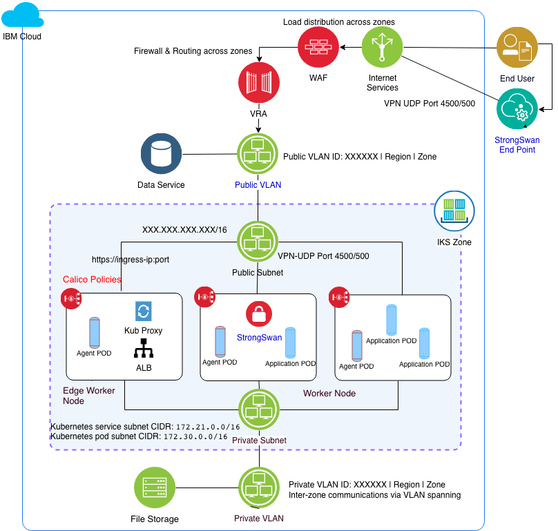

# Networking

This aspect describes the cross-regional, regional and zone network architecture and configuration.

---

## Overall Networking

This view of the network architecture provides a multi-region view with key components for connectivity and network segregation across the region. Key services such as VLANs are pre-requisites for running the provided scripts.

### Overall Network Architecture

---

### Overall Network Components

- Load balancing: This solution uses the IBM Cloud Internet Services (CIS) service for global load balancing across two regions (i.e. primary and DR). The [multi-zone load balancer (MZLB)](https://console.bluemix.net/docs/containers/cs_clusters_planning.html#mz_setup), a component of the IKS service, provides for distribution of load across each of the zones in the cluster.  The zone ALB then distributes across the pods in the cluster. See the network section for additional details. Please check out IBM Cloud Docs for additional [IBM Cloud load balancing options](https://console.bluemix.net/docs/infrastructure/loadbalancer-service/explore-load-balancers.html).

- DNS registration: The [CIS](https://console.bluemix.net/docs/infrastructure/cis/dns-concepts.html#dns-concepts) provides trusted DNS servers to maintain the DNS mapping of the IPs for your active zones. The [MZLB] performs health checks(https://console.bluemix.net/docs/containers/cs_clusters_planning.html#mz_setup) with the public ALB IP in each zone of a region and keeps the DNS lookup results updated based on these health checks. See the network section for additional details.

- Routing/Firewalls: IBM Cloud offers several routing and security services including [vSRX](https://console.bluemix.net/docs/infrastructure/vsrx/getting-started.html#getting-started) and [Calico](https://console.bluemix.net/docs/containers/cs_network_policy.html#default_policy). You can review this table on [IBM Cloud security capabilities](https://console.bluemix.net/docs/infrastructure/fortigate-10g/explore-firewalls.html#explore-firewalls)  to determine if additional services are needed to augment this architecture. This solution leverages Calico policies for all worker nodes. See the security section for additional details.

- VLANs: IBM Cloud provides VLANs as a service as private or public. This solution uses a public and private VLAN for each cluster. This requires use of a public / private VLAN pair in each of the Kubernetes zones. As [noted here](https://console.bluemix.net/docs/containers/cs_clusters_planning.html#multizone), the use of multi-zone requires you to activate [VLAN spanning](https://console.bluemix.net/docs/infrastructure/vlans/vlan-spanning.html#vlan-spanning) for the account.

- VPN: IBM Cloud offers multiple VPN solutions for connecting your cluster to an on premises network including DirectLink, IPSec and strongSwan. This solution uses strongSwan to connect the cluster to manage and IAM services on premises. The strongSwan service is deployed into your cluster using a Helm chart. The VPN services enable you to remap cluster subnets  using the local SubnetNAT setting. Network Address Translation (NAT) for subnets provides a workaround for subnet conflicts between the cluster network and on-premises remote network. The VPN tunnel sees remapped IP subnets instead of the original subnets. Remapping happens before the packets are sent over the VPN tunnel as well as after the packets arrive from the VPN tunnel. You can expose both remapped and non-remapped subnets at the same time over the VPN.

  - For this example, we selected the strongSwan VPN to demonstrate its ability to deploy automatically, provide connectivity for monitoring and management functions of the cluster and for the applications running in the cluster.

- IBM Cloud Data Services: The IBM services are essentially APIs available over the public internet. Communications to and from these services will be performed over the public VLAN by worker nodes or edge worker nodes. Replication or backup of data services is also performed via the APIs.

---

## IKS Cluster Zone Network
This network architecture provides a cluster/zone view with key components for connectivity and network segregation across the cluster. Key services are identified that require values for configuration and parameterization are pre-requisites for running the provided scripts.

---

### Cluster/Zone Network Architecture

---

### Cluster/Zone Network Components

- VPN: As noted above, the [strongSwan VPN](https://console.bluemix.net/docs/containers/cs_vpn.html#vpn) is used to provide connectivity for the IKS cluster to an IPSec end point running on premises in another location. The strongSwan service is deployed into the cluster using a [Helm chart](https://console.bluemix.net/docs/containers/cs_vpn.html#vpn-setup). When running a single HA cluster with multiple zones, a single strongSwan deployment in one of the zones supports communication across the cluster.

- Multi-zone load balancer: For a single cluster, the [multi-zone load balancer (MLZB)](https://console.bluemix.net/docs/containers/cs_loadbalancer.html#loadbalancer) will balance across each of the zones in same cluster.

- VRA: IBM Cloud provides options for edge device (routing / firewall) services. Use the [IBM Cloud firewall options](https://console.bluemix.net/docs/infrastructure/fortigate-10g/explore-firewalls.html#explore-firewalls) to make your choice based on your teams' needs.  These options can be augmented by deploying and managing open or third-party services. See this page in IBM Cloud Docs for information on setting up [private network clustering](https://console.test.cloud.ibm.com/docs/containers?topic=containers-planning#private_vlan).

- [Cluster Networks](https://console.bluemix.net/docs/containers/cs_network_planning.html#planning): The load balancer networking approach is used in this example solution. We include a public and private VLAN [requested via the catalog](https://console.bluemix.net/catalog/infrastructure/vlan) prior to running the automation. When the scripts are run to create the cluster, the IKS service automatically provisions a portable public subnet and a portable private subnet. Each subnet provides 5 portable usable IP addresses with one used by default ALB on that subnet. Additional architecture details are provided in the [IKS Service's documentation](https://console.bluemix.net/docs/containers/cs_loadbalancer.html#planning).

- [Data Service](https://console.bluemix.net/docs/services/Cloudant/getting-started.html#getting-started-with-cloudant): The Cloudant data service is used in this solution to provide the scripts for deploying, binding (via Kubernetes secret) and configuring a data service. Other IBM Cloud data services, deploying a data onto IBM Cloud infrastructure or using a remote data service are covered in other examples.
